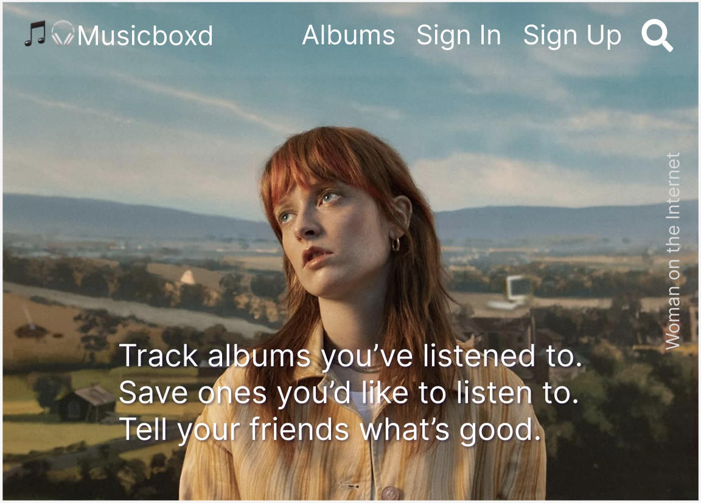
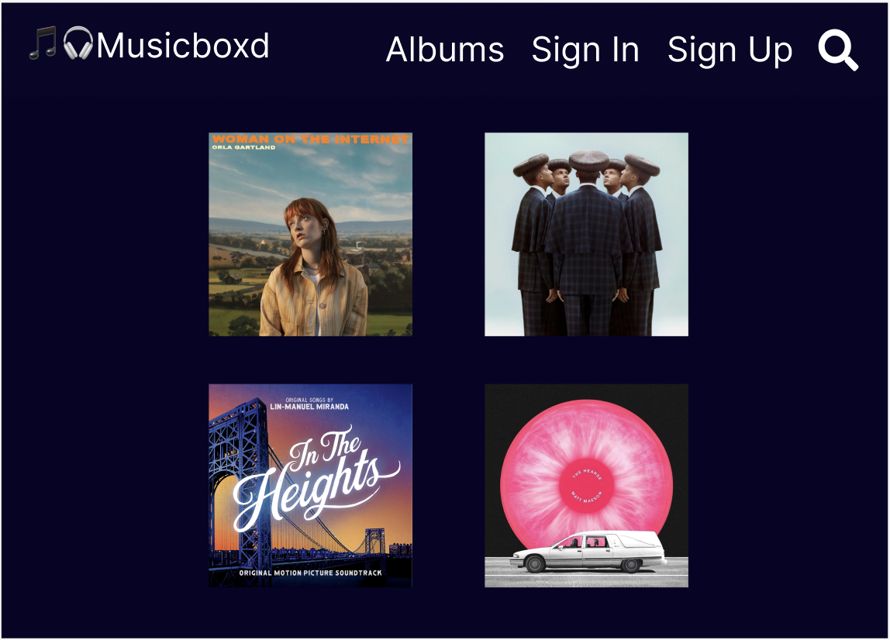
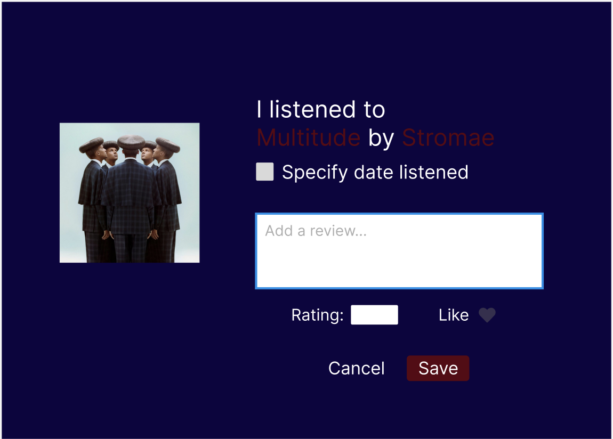
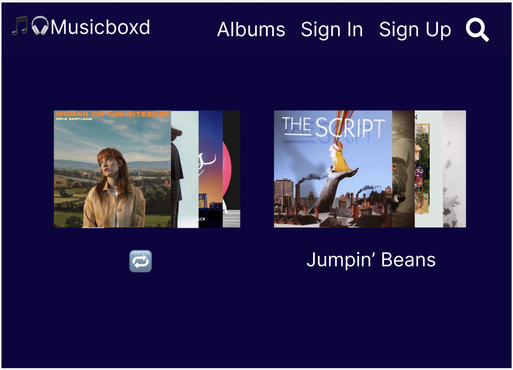
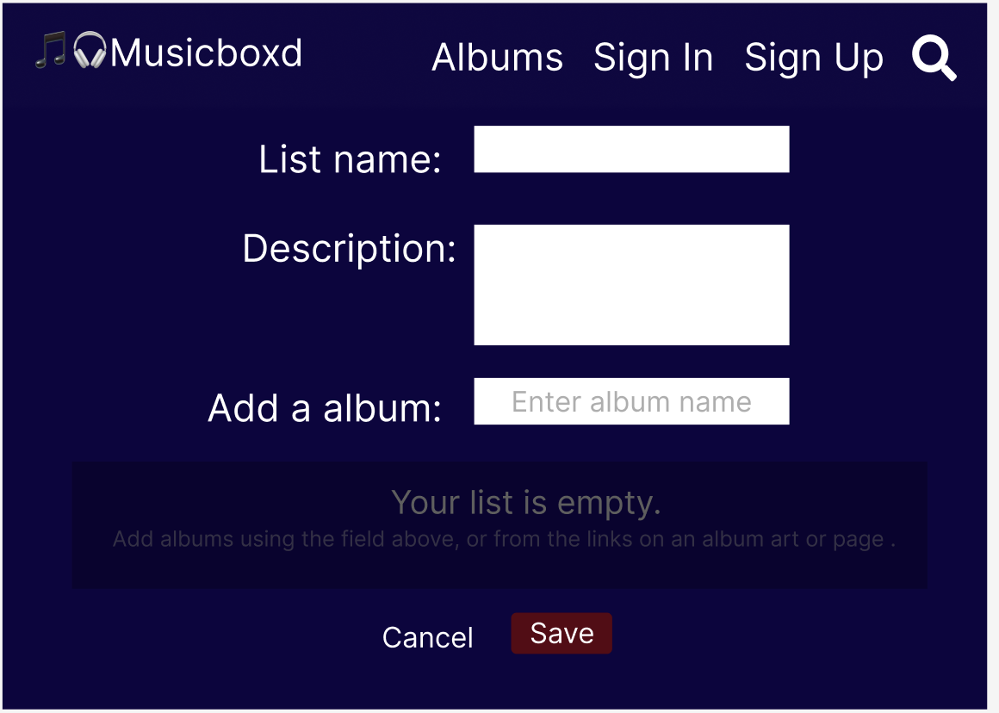
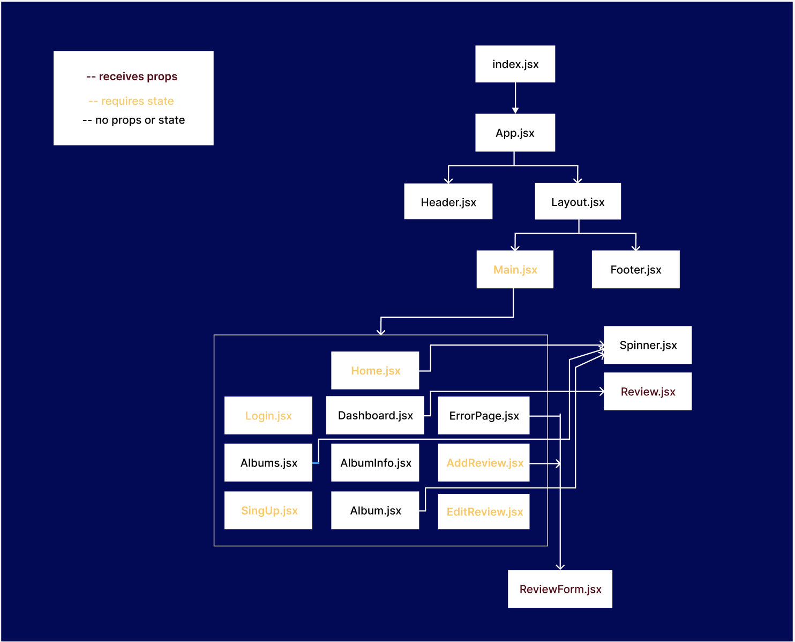

# 🎵🎧 Musicboxd

Like letterboxd, but for music. A full stack application that will allow a user to keep track of albums they've listened to, leave a review for each album and create lists for albums. Live site  👉🏽 [here](https://musicboxd.netlify.app/). And backend [here](https://musixboxd.onrender.com/api/).

## Feature List 
- User Auth (Login, Logout, Auth view)
- CRUD operations

## Wireframes 

### Home

### Albums

### AddReview

### Lists

### CreateLists


## Component Hierarchy


## API Endpoints
#### Base url: _https://musixboxd.onrender.com/api_

```
Endpoints:
- Albums
        GET /albums
            /albums/:id
        POST /albums
        
- Auth
        POST /users/register
             /users/login
             
- Reviews (protected)
          GET /reviews
              /reviews/:id
          POST /reviews/
          PUT  /reviews/:id/edit
          DELETE /reviews/:id
  ```
## Technologies Used
### Frontend
- [Vite](https://vitejs.dev/)
- [ReactJS](reactjs.org/)
- [React Router](https://reactrouter.com/)
- [Axios](https://axios-http.com/)
- [dotenv](https://www.npmjs.com/package/dotenv)
- [Redux](https://redux.js.org/)
- [Redux Toolkit](https://redux-toolkit.js.org/)
- [Google Fonts](https://fonts.google.com/)
- [Spotify API](https://developer.spotify.com/documentation/web-api/)

### Backend
- [Axios](https://axios-http.com/)
- [Mongoose](https://mongoosejs.com/)
- [ExpressJS](https://expressjs.com/)
- [bcryptjs](https://www.npmjs.com/package/bcryptjs)
- [jsonwebtoken](https://www.npmjs.com/package/jsonwebtoken)
- [Concurrently](https://www.npmjs.com/package/concurrently)
- [dotenv](https://www.npmjs.com/package/dotenv)
- [Nodemon](https://nodemon.io/)
- [cors](https://www.npmjs.com/package/cors)
- [express-async-handler](https://www.npmjs.com/package/express-async-handler)
- [morgan](https://www.npmjs.com/package/morgan)

## MVP
- [x] Authorization/Authentication
- [x] CRUD operations
- [x] Protected routes
- [x] User dashboard

## Post-MVP
- [ ] Add functionality to make lists
- [ ] Show user reviews and lists publicly
- [ ] List album songs when displaying album info
- [ ] Search functionality
- [ ] Get more data into database
- [ ] Proper 404 page